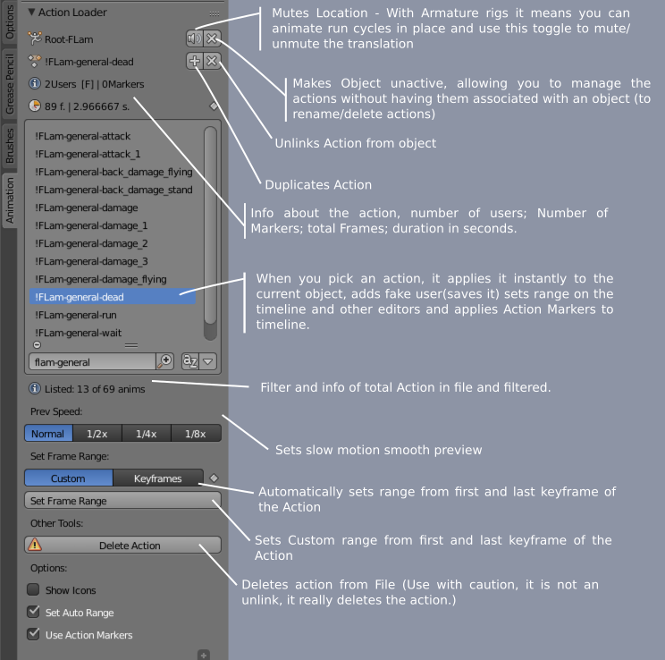

# Action Loader
ActionLoader.py

Action Loader is a Blender addon for quickly displaying and loading actions into a model. It was done particularly to manage multiple actions / animations on the same character, for game animations.

preview: https://www.youtube.com/watch?v=aQrfsufhyWw

## What are actions?

If you are not aware of how actions work, or are not used to blender. Actions are the way blender stores animations for objects, and for armatures(Rigs). This means each action will have a complete animation for an entire rig, including all the complex constraints and key frames you can throw at it. So, with this addon, you are able to switch between entire actions with one click.
Actions also work interchangeably between objects (or entire rigs) this means you can have different characters, with different rigs and totally different proportions, and still use the same animations in both, as long as you use the same name for the bones (you can also have specific bones for each characters that those speficil animations will also be stored).

## How to use Action Loader?

To install, in Blender go to Edit > Preferences > Add-ons > Install and pick the ActionLoader.py directly. Then activate it on the addons list, you might have to use the search to find it.

I have automated most things, so you just have to select an object, usually an armature, and select the actions from the list.

And with that one click you get:
- It will automatically save the current frame range on the current action;
- Apply the newly selected action;
- Set the frame range on the scene from the selected action; (optionally: set frame range from first and last keyframe.)
- Zoom in on all time viewers (Timeline Dopesheet Editor and Graph Editor). 

And:
- You can switch from animation while playing the animations in loop for a really quick preview of all your work.

- It also ads fake users to the actions automatically so you don't have to think about it nor worry about loosing actions.

- There is a filter in the list, so that if you have hundreds of animations, just carefully name them, and use that filter to display only a set of animations, for example, fighting animations can have a tag in the name, and you filter for it etc...

- It also displays some information about the actions, that can be helpfull, currently: the name, number of frames (from the frame range) and duration in seconds, number of users, and if it has a fake user (for your mental sanity check!). 

- Other info: shows the total number of animations in the file and number of listed (filtered) animations.

Any comments, ideas etc... are welcome, please issue them!

### Links:

[Thread on Blenderartists.org](https://blenderartists.org/forum/showthread.php?420530-AddOn-Action-Loader)

